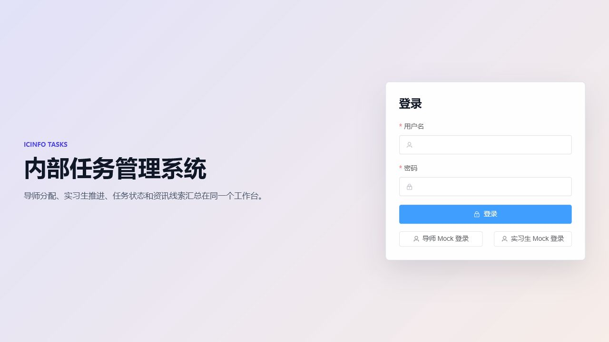
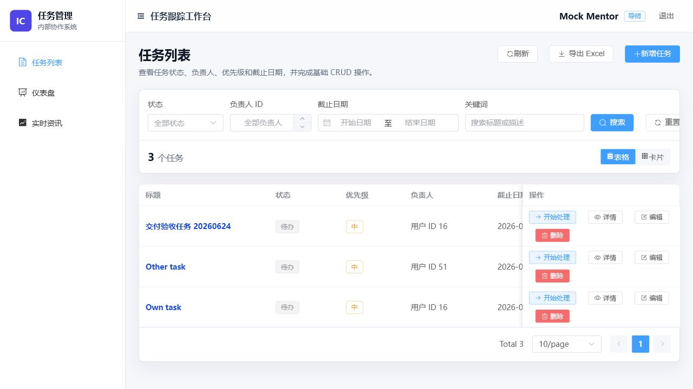
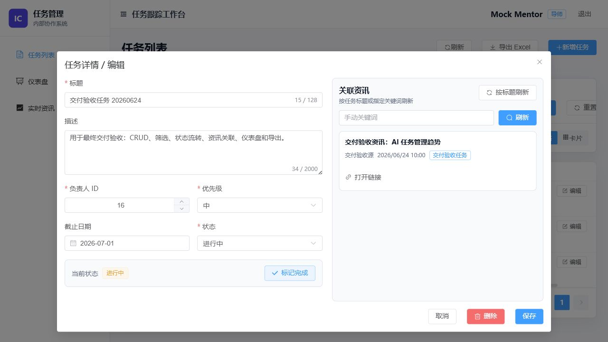
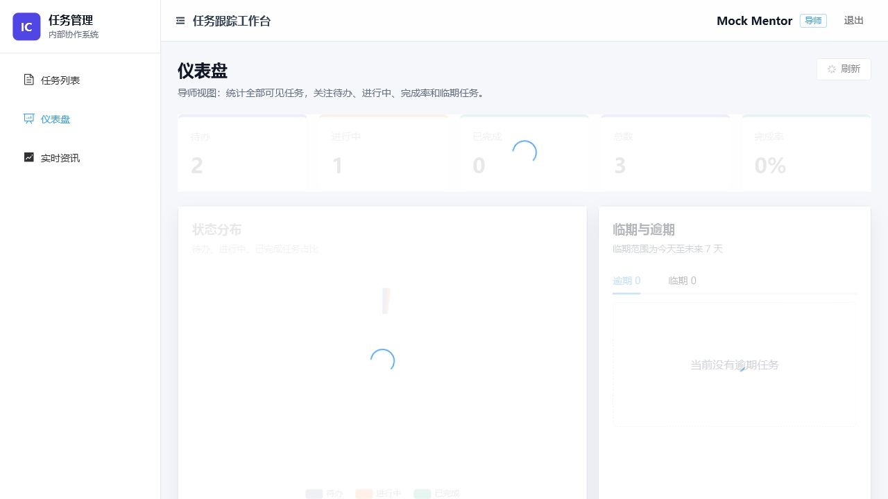
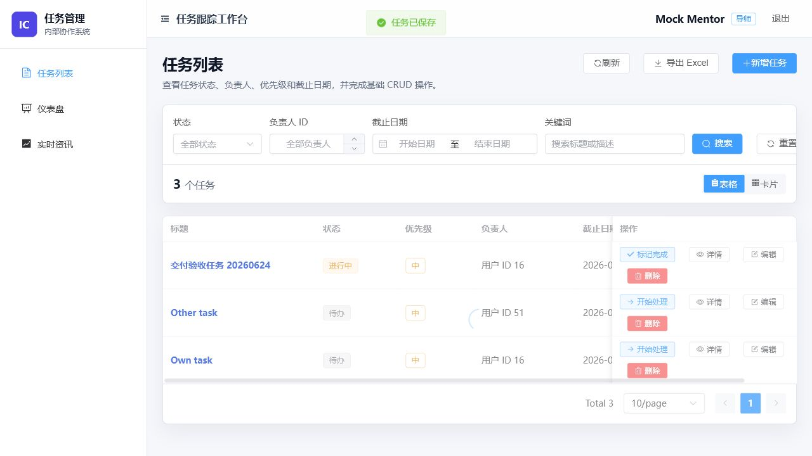

# 内部任务管理系统

内部任务管理系统用于导师和实习生之间的任务分配、跟踪、检索、资讯关联、统计分析和 Excel 导出。后端使用 Spring Boot 3 + MyBatis-Plus + MySQL，前端使用 Vue3 + Vite + TypeScript + Element Plus。

## 环境要求

- Java 17
- Maven 3.8+
- Node.js 20+，本机 PowerShell 如禁止执行 `npm.ps1`，请使用 `npm.cmd`
- MySQL 8.0，默认数据库为 `icinfo_task_management`

## 数据库初始化

首次启动前按以下顺序执行 SQL。顺序不可颠倒，因为后续表依赖前面的用户、任务和资讯表。

```sql
SOURCE sql/00-create-database.sql;
SOURCE sql/01-auth-users.sql;
SOURCE sql/02-task-tasks.sql;
SOURCE sql/03-news-items.sql;
SOURCE sql/04-task-news.sql;
```

默认连接配置在 `src/main/resources/application.yml`：

- `DB_URL`：默认 `jdbc:mysql://localhost:3306/icinfo_task_management?...`
- `DB_USERNAME`：默认 `root`
- `DB_PASSWORD`：默认 `root`

如本机配置不同，启动前设置同名环境变量覆盖。

## 后端启动

```powershell
mvn spring-boot:run
```

默认地址：`http://localhost:8080`

健康检查：

```powershell
Invoke-RestMethod -Uri "http://localhost:8080/api/health"
```

## 前端启动

```powershell
cd frontend
npm install
npm.cmd run dev
```

默认地址：`http://localhost:5173`

前端默认通过 Vite 代理访问 `http://localhost:8080/api`。如需改后端地址，可在 `frontend/.env.local` 中设置：

```text
VITE_API_BASE_URL=http://localhost:8080/api
```

## 测试账号

| 角色 | 用户名 | 密码 | 说明 |
| --- | --- | --- | --- |
| 导师 | `mentor_mock` | `mentor123` | 可查看全部任务，新增、编辑、删除任务，导出任务，查看全量仪表盘 |
| 实习生 | `intern_mock` | `intern123` | 只能查看和维护分配给自己的任务，不能新增或删除任务 |

登录页也提供“导师 Mock 登录”和“实习生 Mock 登录”按钮，可不输入密码直接进入对应角色。

## 主要功能

- 登录：支持用户名密码登录和 Mock 登录，登录后保存 JWT 并通过路由守卫保护页面。
- 任务 CRUD：导师可新增、查看、编辑、删除任务；实习生可查看和编辑自己可见范围内的任务。
- 筛选搜索：任务列表支持按状态、负责人 ID、截止日期范围和关键词组合筛选。
- 状态流转：支持 `待办 -> 进行中 -> 已完成` 的按钮式流转，并按角色和任务归属限制操作。
- 资讯：支持资讯列表、关键词刷新、任务关联资讯查询与刷新；外部资讯失败时不阻断任务主流程。
- 仪表盘：展示待办、进行中、已完成、总数、完成率、状态分布图和临期/逾期任务。
- Excel 导出：从任务列表导出当前权限范围和筛选条件下的 `.xlsx` 文件。

## 功能截图

### 登录页


### 任务列表


### 任务弹窗含资讯


### 仪表盘


### 导出入口


## AI 工具使用说明

本项目使用 AI 工具辅助需求拆解、接口和 DTO 对齐、前端页面实现、测试设计、SQL 与文档编写。AI 主要参与了以下工作：

- 根据 `plan.md` 和 `detailed-design.md` 拆分后端、前端和交付任务。
- 辅助生成 Spring Boot 控制器、服务、DTO、权限判断、资讯降级和 Excel 导出实现思路。
- 辅助生成 Vue3 页面、Element Plus 表单/表格/弹窗、ECharts 仪表盘和 API 调用代码。
- 辅助整理 SQL 执行顺序、测试账号、验收步骤和 README。

AI 生成内容均通过人工检查和实际运行验证：后端执行 `mvn test`，前端执行 `npm.cmd run build`，并使用浏览器分别完成导师主流程和实习生权限边界验收。

## 本次验证记录

验证时间：2026-06-25

已执行命令：

```powershell
mvn test                        # 41 tests run, 0 failures, 0 errors — BUILD SUCCESS
npm.cmd run build               # vite build succeeded (2,170 kB JS + 372 kB CSS gzipped to 719 + 51 kB)
mvn spring-boot:run             # 后端启动于 http://localhost:8080
npm.cmd run dev                 # 前端启动于 http://localhost:5173
Invoke-RestMethod -Uri "http://localhost:8080/api/health"
```

浏览器验收结果：

- 导师账号完成登录、任务新增、关键词筛选、状态流转、任务详情/编辑、关联资讯查看、仪表盘查看和 Excel 导出入口点击。
- 导师删除权限通过临时任务验证：创建临时任务后删除成功，再查询返回业务码 `404`。
- 实习生账号只能看到分配给自己的任务，不能看到 `Other task`，页面无“新增任务”和“删除”入口。
- 实习生直接访问他人任务接口返回业务码 `403`。

遇到的问题和处理：

- PowerShell 默认读取中文文档会出现编码乱码，改用 UTF-8 读取和写入。
- 本机 PowerShell 禁止直接执行 `npm.ps1`，改用 `npm.cmd run build` 和 `npm.cmd run dev`。
- Vite 构建提示部分 chunk 超过 500 kB，以及第三方依赖注释会被 Rollup 移除；构建结果成功，作为后续性能优化风险记录。
- 外部资讯源存在不稳定风险，后端已提供缓存和降级处理；本次截图使用已关联的资讯记录验证弹窗展示。

## 当前风险

- 后端本地运行依赖 MySQL 8.0 和正确的 `DB_*` 配置，演示前需确认数据库服务已启动并已执行 SQL。
- 资讯刷新依赖外部公开 API/RSS，网络异常时可能只能返回缓存或友好错误。
- 前端构建包体较大，后续可通过路由级动态导入和 ECharts 分包继续优化。
