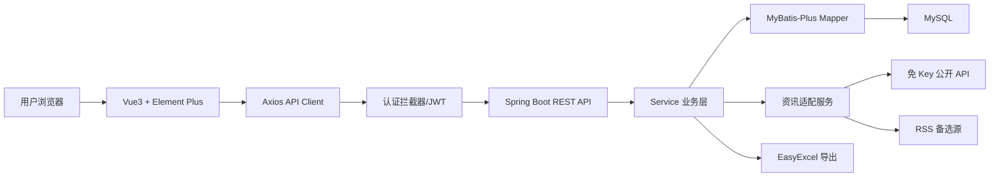
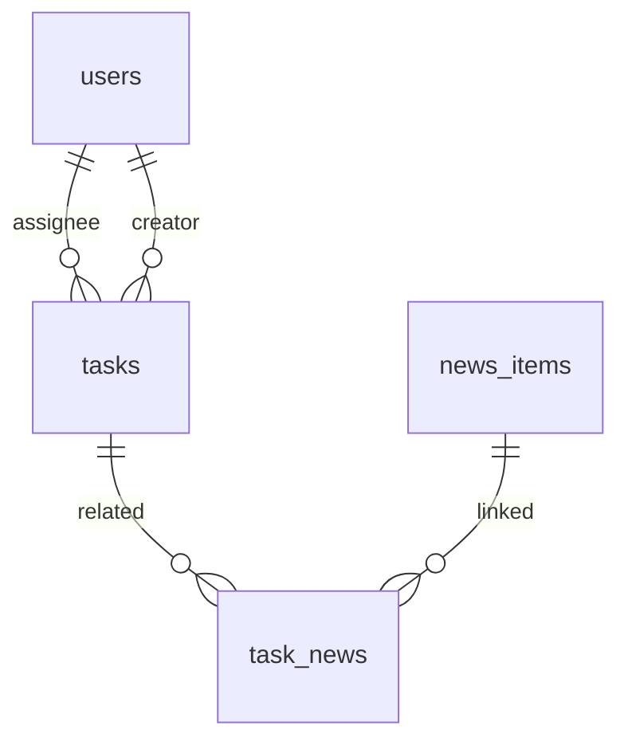

# 内部任务管理系统详细设计

## 1. 设计目标与边界

本系统面向导师与实习生的内部任务分配、跟踪、检索、资讯关联和统计分析，采用前后端分离架构：后端使用 Java 17 + Spring Boot 3.x + MyBatis-Plus + MySQL，前端使用 Vue3 + Vite + Composition API + Element Plus。认证采用 JWT，同时提供 Mock 登录入口；注册为简化版账号创建。设计按认证、任务、状态流转、筛选搜索、资讯、仪表盘、Excel 导出、前端页面八个模块拆分，各模块通过 DTO/API 交互，避免跨模块直接依赖，便于独立开发和测试。

## 2. 总体架构

后端包结构：`controller` 负责 REST 接口和参数校验；`service` 负责权限、状态流转、资讯聚合和导出；`mapper` 负责 MyBatis-Plus 数据访问；`entity` 映射数据库表；`dto` 定义请求/响应；`config` 放置 JWT、CORS、MyBatis-Plus、初始化配置；`exception` 统一异常响应。前端结构：`src/api` 封装接口，`src/views` 放登录、任务、资讯、仪表盘页面，`src/components` 放任务表单、任务表格/卡片、资讯列表、图表组件，`src/stores` 保存用户和筛选状态，`src/router` 处理登录守卫，`src/types` 同步后端 DTO 字段。

## 3. 模块详细设计

| 模块 | 后端职责 | 前端职责 | 独立测试点 |
| --- | --- | --- | --- |
| 用户认证 | 登录、Mock 登录、简化注册、签发/解析 JWT、获取当前用户 | 登录页、Mock 账号入口、保存 token、路由守卫 | 登录成功返回 token；无 token 被拦截；注册用户名重复校验 |
| 任务管理 | 任务 CRUD、导师/实习生数据范围控制、创建人与负责人维护 | 任务列表、表格/卡片切换、任务详情/编辑弹窗 | 导师可查全部；实习生仅查本人；CRUD 字段完整 |
| 状态流转 | 校验任务归属和角色，按钮触发 TODO/IN_PROGRESS/DONE 更新 | 状态按钮、状态标签、禁用无权限操作 | 状态更新接口；实习生不能改他人任务；非法状态拒绝 |
| 筛选搜索 | 按状态、负责人、截止日期、关键词组合查询 | 筛选表单、重置、分页/刷新 | 多条件组合 SQL；空条件查询；关键词模糊匹配 |
| 实时资讯 | 优先调用免 Key API，失败时降级 RSS；缓存资讯；按关键词检索 | 任务详情侧栏、独立资讯页、搜索、刷新 | API 失败不影响任务；RSS 降级；缓存查询 |
| 资讯关联 | 根据任务标题/关键词刷新并关联资讯 | 任务详情展示关联资讯、手动刷新 | 任务与资讯关联表写入；重复关联去重 |
| 仪表盘 | 按当前用户权限统计待办、进行中、已完成、完成率 | 统计卡片、ECharts 状态分布/完成率图 | 导师统计全量；实习生统计本人；完成率计算 |
| Excel 导出 | 使用 EasyExcel 导出当前权限范围和筛选条件下的任务 | 导出按钮、下载文件 | 文件响应头正确；导出数据遵守权限和筛选条件 |

## 4. 数据库设计

| 表 | 关键字段 | 说明 |
| --- | --- | --- |
| `users` | `id`, `username`, `password`, `display_name`, `role`, `created_at` | 用户表；`role` 为 `MENTOR`/`INTERN`；密码可在 MVP 中简化加密，但接口层不返回 |
| `tasks` | `id`, `title`, `description`, `status`, `priority`, `assignee_id`, `creator_id`, `due_date`, `created_at`, `updated_at` | 任务主表；`status` 为 `TODO`/`IN_PROGRESS`/`DONE`；`priority` 为 `HIGH`/`MEDIUM`/`LOW` |
| `news_items` | `id`, `title`, `url`, `source`, `keyword`, `published_at`, `fetched_at` | 外部资讯缓存；按 `keyword` 保存检索来源，避免重复请求 |
| `task_news` | `id`, `task_id`, `news_id`, `created_at` | 任务与资讯关联；建议对 `task_id + news_id` 建唯一索引 |

MySQL 建议索引：`users.username` 唯一索引；`tasks.status`、`tasks.assignee_id`、`tasks.due_date` 普通索引；`news_items.url` 唯一索引；`task_news(task_id, news_id)` 唯一索引。

## 5. API 设计

| 方法 | 路径 | 请求/参数 | 响应/说明 |
| --- | --- | --- | --- |
| `POST` | `/api/auth/login` | `username`, `password` | 返回 JWT 和用户信息 |
| `POST` | `/api/auth/mock-login` | `role` 或 `username` | Mock 登录入口，返回 JWT |
| `POST` | `/api/auth/register` | `username`, `password`, `displayName`, `role` | 简化注册，默认校验用户名唯一 |
| `GET` | `/api/auth/me` | Header JWT | 当前登录用户 |
| `GET` | `/api/tasks` | `status`, `assigneeId`, `dueDateStart`, `dueDateEnd`, `keyword`, `page`, `size` | 任务分页列表，自动应用权限范围 |
| `POST` | `/api/tasks` | 标题、描述、负责人、优先级、截止日期、状态 | 创建任务，仅导师可分配负责人 |
| `GET` | `/api/tasks/{id}` | 路径参数 | 任务详情，校验可见权限 |
| `PUT` | `/api/tasks/{id}` | 任务编辑 DTO | 编辑任务 |
| `DELETE` | `/api/tasks/{id}` | 路径参数 | 删除任务，导师权限 |
| `PATCH` | `/api/tasks/{id}/status` | `status` | 按按钮切换状态 |
| `GET` | `/api/tasks/export` | 同任务列表筛选参数 | EasyExcel 导出 `.xlsx` |
| `GET` | `/api/news` | `keyword`, `page`, `size` | 资讯列表/搜索 |
| `POST` | `/api/news/refresh` | `keyword` | 按关键词刷新资讯，优先免 Key API，失败降级 RSS |
| `GET` | `/api/tasks/{id}/news` | 路径参数 | 查询任务关联资讯 |
| `POST` | `/api/tasks/{id}/news/refresh` | `keyword` 可选 | 按任务标题或手动关键词刷新并关联资讯 |
| `GET` | `/api/dashboard/summary` | Header JWT | 待办、进行中、已完成、完成率 |
| `GET` | `/api/dashboard/status-chart` | Header JWT | ECharts 状态分布数据 |

统一响应格式：`{ code, message, data }`。统一错误包括参数错误、未登录、无权限、资源不存在、外部资讯刷新失败。资讯刷新失败时返回友好错误或缓存数据，不阻断任务 CRUD。

## 6. 权限与业务规则

导师可查看全部任务、创建任务、分配负责人、编辑/删除任务、导出全量可筛选任务、查看全量统计。实习生只能查看分配给自己的任务，可编辑自身任务允许开放的字段并切换状态，不允许删除任务或访问他人任务。任务状态由按钮切换，合法值为 `TODO`、`IN_PROGRESS`、`DONE`；截止日期早于当前日期且状态不是 `DONE` 时，前端标记为逾期。Excel 导出必须复用任务列表查询条件和权限过滤，避免导出越权数据。

## 7. 前端页面设计

登录页包含用户名密码登录、导师/实习生 Mock 登录按钮、简化注册入口；任务列表页包含筛选栏、表格/卡片视图切换、新增、编辑、删除、状态按钮和 Excel 导出；任务详情/编辑弹窗展示任务字段和右侧关联资讯侧栏，支持按任务标题或手动关键词刷新；资讯独立页面提供关键词搜索、刷新和资讯列表；个人仪表盘展示待办、进行中、已完成、完成率及 ECharts 图表，并展示临期/逾期提示。

## 8. 验证方案与 AI 使用说明

后端优先验证 Service 单元测试和 Controller 接口测试：认证、权限过滤、任务 CRUD、状态流转、资讯降级、Excel 导出。前端验证登录守卫、任务筛选、弹窗编辑、资讯刷新和图表渲染。联调时以导师账号和实习生账号分别检查数据边界。AI 工具可辅助需求拆解、接口设计、实体/DTO/Mapper/组件/SQL/文档生成；所有 AI 生成内容通过编译、接口联调、权限人工检查和导出文件检查验证。重点防范字段名不一致、接口路径不一致、权限遗漏、CORS/JWT 拦截配置错误、外部 API 不稳定等问题。
