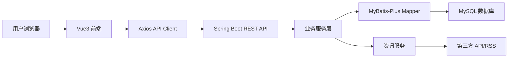
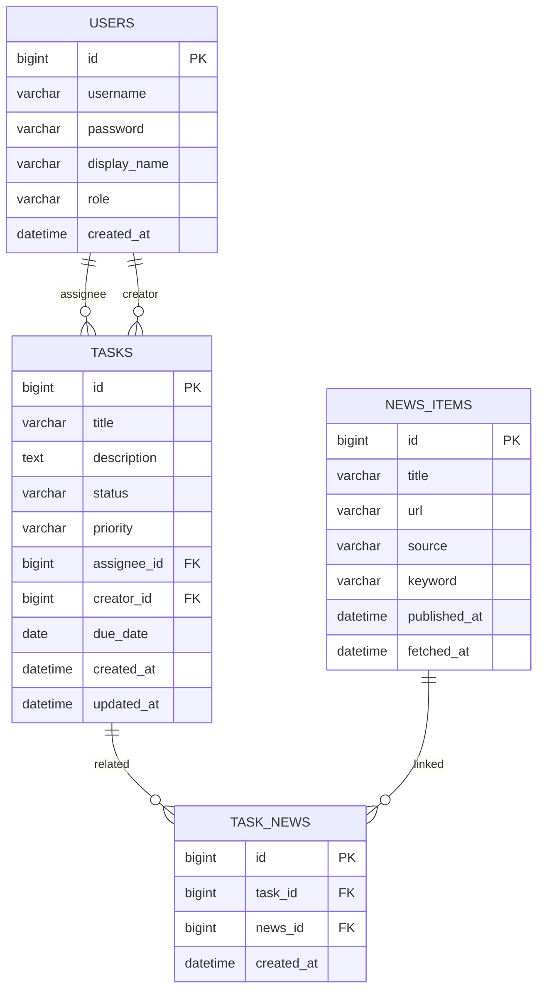

# 内部任务管理系统需求与实施计划

## 1. 项目目标

本项目目标是在 48 小时内完成一个可运行的内部任务管理系统 MVP，用于实习生和导师之间分配、跟踪、检索和统计日常任务。系统采用 Spring Boot + Vue3 前后端分离架构，重点体现功能完整度、工程结构规范、AI 辅助开发能力和文档质量。

## 2. 用户角色与核心场景

### 2.1 用户角色

| 角色 | 权限说明 |
| --- | --- |
| 导师 | 可查看所有任务，创建任务，分配负责人，更新任务状态，查看统计信息 |
| 实习生 | 只能查看和维护分配给自己的任务，更新任务状态，查看个人统计 |

### 2.2 核心场景

1. 用户通过登录页进入系统，可使用简化登录或 Mock 登录。
2. 导师创建任务，设置标题、描述、负责人、优先级、截止日期和状态。
3. 实习生在任务列表中查看自己的任务，可按状态、负责人、截止日期和关键词筛选。
4. 用户在任务详情/编辑弹窗中查看任务信息，并关联查看外部实时资讯。
5. 用户通过按钮或拖拽方式完成任务状态流转：待办 -> 进行中 -> 已完成。
6. 用户在个人仪表盘查看待办数量、已完成数量和完成率图表。

## 3. 功能范围

### 3.1 必做功能

| 模块 | 功能 | 说明 |
| --- | --- | --- |
| 用户认证 | 登录/注册 | 支持 JWT 或 Session；MVP 阶段可使用 Mock 用户 |
| 任务管理 | 任务 CRUD | 支持创建、查看、编辑、删除任务 |
| 状态流转 | 状态切换 | 支持待办、进行中、已完成三种状态 |
| 筛选搜索 | 多条件查询 | 按状态、负责人、截止日期、关键词检索 |
| 实时资讯 | 外部资讯获取 | 调用公开 API 或 RSS 获取真实资讯 |
| 资讯关联 | 任务相关资讯 | 在任务详情或任务表单中按任务关键词展示相关资讯 |
| 资讯操作 | 展示/搜索/刷新 | 支持资讯列表、关键词搜索和手动刷新 |
| 前端页面 | 核心页面 | 登录页、任务列表页、任务详情/编辑弹窗、个人仪表盘 |

### 3.2 建议加分功能

| 功能 | 实现建议 | 优先级 |
| --- | --- | --- |
| 任务优先级 | 高/中/低，使用颜色标签区分 | 高 |
| 统计图表 | 使用 ECharts 展示完成率和状态分布 | 高 |
| 截止日期提醒 | 前端标记临期/逾期任务，后端保存截止日期 | 中 |
| 角色权限 | 导师查看全部，实习生仅查看自己 | 高 |
| Excel 导出 | 后端生成 Excel，前端下载任务列表 | 中 |

## 4. 技术选型

| 层级 | 技术 | 选择理由 |
| --- | --- | --- |
| 后端 | Java 17 + Spring Boot 3.x | 符合题目要求，生态成熟，适合快速构建 RESTful API |
| 持久层 | MyBatis-Plus | 减少样板代码，便于快速实现分页、条件查询和权限过滤 |
| 数据库 | MySQL 8.0 | 与交付 SQL 脚本一致，适合本地演示和后续部署 |
| 认证 | JWT 或 Mock Token | 降低认证复杂度，同时保留前后端鉴权流程 |
| 前端 | Vue3 + Vite + Composition API | 启动快、开发效率高，符合题目要求 |
| UI | Element Plus | 表单、表格、弹窗、标签和布局组件完整 |
| 请求 | Axios | 前端 REST API 调用标准方案 |
| 图表 | ECharts | 快速实现仪表盘统计图 |
| 资讯 | RSS/API 适配服务 | 满足外部真实资讯获取、搜索、刷新和任务关联 |

## 5. 系统架构

### 5.1 后端分层

| 包/目录 | 职责 |
| --- | --- |
| controller | REST 接口，参数校验，统一响应 |
| service | 业务逻辑，权限判断，状态流转，资讯聚合 |
| mapper | MyBatis-Plus 数据访问 |
| entity | 数据库实体 |
| dto | 请求/响应对象 |
| config | CORS、认证拦截、初始化配置 |
| exception | 统一异常处理 |

### 5.2 前端结构

| 目录 | 职责 |
| --- | --- |
| src/api | Axios 封装和接口模块 |
| src/views | 登录页、任务页、仪表盘页 |
| src/components | 任务表单、任务卡片、资讯列表、统计图表 |
| src/stores | 用户状态、任务筛选状态 |
| src/router | 页面路由和登录守卫 |
| src/types | TypeScript 类型定义 |

## 6. 数据库设计

### 6.1 表结构说明

| 表 | 说明 |
| --- | --- |
| users | 用户表，保存导师和实习生账号 |
| tasks | 任务表，保存任务基础信息、状态、优先级和截止日期 |
| news_items | 资讯表，缓存从外部 API/RSS 获取的资讯 |
| task_news | 任务与资讯关联表，用于任务详情页展示相关资讯 |

### 6.2 枚举值

| 字段 | 可选值 |
| --- | --- |
| role | MENTOR, INTERN |
| status | TODO, IN_PROGRESS, DONE |
| priority | HIGH, MEDIUM, LOW |

## 7. 主要 API 设计

### 7.1 认证接口

| 方法 | 路径 | 说明 |
| --- | --- | --- |
| POST | /api/auth/login | 用户登录，返回 token 和用户信息 |
| POST | /api/auth/register | 用户注册，可选实现 |
| GET | /api/auth/me | 获取当前登录用户 |

### 7.2 任务接口

| 方法 | 路径 | 说明 |
| --- | --- | --- |
| GET | /api/tasks | 查询任务列表，支持状态、负责人、截止日期、关键词筛选 |
| POST | /api/tasks | 创建任务 |
| GET | /api/tasks/{id} | 查看任务详情 |
| PUT | /api/tasks/{id} | 编辑任务 |
| DELETE | /api/tasks/{id} | 删除任务 |
| PATCH | /api/tasks/{id}/status | 更新任务状态 |
| GET | /api/tasks/export | 导出任务 Excel |

### 7.3 资讯接口

| 方法 | 路径 | 说明 |
| --- | --- | --- |
| GET | /api/news | 查询资讯列表，支持关键词搜索 |
| POST | /api/news/refresh | 手动刷新外部资讯 |
| GET | /api/tasks/{id}/news | 查询任务关联资讯 |
| POST | /api/tasks/{id}/news/refresh | 根据任务标题/关键词刷新关联资讯 |

### 7.4 统计接口

| 方法 | 路径 | 说明 |
| --- | --- | --- |
| GET | /api/dashboard/summary | 查询我的待办、进行中、已完成数量 |
| GET | /api/dashboard/status-chart | 查询任务状态分布 |

## 8. 前端页面设计

### 8.1 登录页

- 用户输入用户名和密码。
- 支持导师、实习生 Mock 账号快速登录。
- 登录成功后保存 token，跳转任务列表页。

### 8.2 任务列表页

- 顶部提供状态、负责人、截止日期、关键词筛选。
- 支持卡片视图和表格视图切换。
- 每个任务显示标题、状态、优先级、负责人、截止日期。
- 支持新增、编辑、删除、状态切换和导出。

### 8.3 任务详情/编辑弹窗

- 展示和编辑任务基础字段。
- 展示关联资讯列表。
- 支持按任务标题或手动关键词刷新资讯。

### 8.4 个人仪表盘

- 展示我的待办、进行中、已完成数量。
- 使用 ECharts 展示完成率或状态分布。
- 展示临期和逾期任务提醒。

### 8.5 实时资讯区

- 可作为任务详情侧栏或独立页面。
- 展示标题、来源、发布时间和跳转链接。
- 支持关键词搜索和刷新。

## 9. 权限与业务规则

1. 导师可以查看所有任务，实习生只能查看分配给自己的任务。
2. 任务删除建议仅导师可操作，实习生只允许更新自己任务的状态。
3. 状态流转顺序为 TODO -> IN_PROGRESS -> DONE，也允许在编辑弹窗中修正状态。
4. 截止日期早于当前日期且状态不是 DONE 时，前端展示为逾期。
5. 资讯刷新失败时不影响任务主流程，应返回友好错误提示或使用缓存数据。

## 10. 48 小时实施计划

| 阶段 | 时间 | 目标 |
| --- | --- | --- |
| 阶段 1 | 0-4 小时 | 初始化 Spring Boot、Vue3、数据库配置、基础目录结构 |
| 阶段 2 | 4-12 小时 | 完成用户 Mock 登录、任务实体、任务 CRUD API |
| 阶段 3 | 12-20 小时 | 完成任务列表页、筛选、表格/卡片视图、编辑弹窗 |
| 阶段 4 | 20-28 小时 | 完成状态流转、角色权限、优先级、截止日期提醒 |
| 阶段 5 | 28-36 小时 | 完成实时资讯 API/RSS 获取、任务关联资讯、刷新和搜索 |
| 阶段 6 | 36-42 小时 | 完成仪表盘统计、ECharts 图表、Excel 导出 |
| 阶段 7 | 42-48 小时 | 联调测试、补 README、SQL 脚本、设计文档和截图 |

## 11. 验收清单

### 11.1 功能验收

- [x] 可以启动后端服务。
- [x] 可以启动前端页面。
- [x] 可以登录导师和实习生账号。
- [x] 可以新增、查看、编辑、删除任务。
- [x] 可以按状态、负责人、截止日期和关键词筛选任务。
- [x] 可以切换任务状态。
- [x] 可以在任务详情中查看或刷新关联资讯。
- [x] 可以在仪表盘看到任务统计。
- [x] 导师和实习生的数据权限符合预期。
- [x] 可以导出任务列表 Excel。

### 11.2 交付验收

- [x] README 包含启动方式、账号说明和功能截图。
- [x] SQL 脚本包含建表语句和初始化数据。
- [x] 设计文档包含架构图、数据库设计、主要 API、技术选型理由。
- [x] 文档说明 AI 工具使用方式、验证过程和遇到的问题。
- [x] 代码结构清晰，命名规范，有统一异常处理和 CORS 配置。

## 12. AI 辅助开发说明

本项目允许使用 AI 工具辅助完成需求拆解、代码生成、Bug 定位、接口设计和文档编写。为了满足评审要求，最终 README 或设计文档中需要说明：

1. 使用了哪些 AI 工具。
2. AI 主要辅助了哪些部分，例如后端实体/API、前端页面组件、SQL、文档。
3. 如何验证 AI 生成内容，例如运行单元测试、接口联调、人工检查权限逻辑。
4. 遇到过哪些 AI 生成错误，例如字段名不一致、接口路径不一致、跨域配置缺失，并说明修正过程。

## 13. 风险与解决方案

| 风险 | 影响 | 解决方案 |
| --- | --- | --- |
| 第三方资讯接口不稳定 | 资讯刷新失败 | 使用 RSS/API 双方案，失败时展示缓存或提示 |
| 48 小时时间紧张 | 功能无法全部完成 | 先保证任务 CRUD、状态流转、资讯关联和核心页面 |
| 权限逻辑遗漏 | 评审扣分 | 在 service 层统一判断角色和任务归属 |
| 前后端字段不一致 | 联调失败 | 使用统一 DTO 和 TypeScript 类型，接口文档同步更新 |
| 数据库环境差异 | 演示启动失败 | 默认使用 MySQL，启动前按 README 执行 SQL 并检查 `DB_*` 配置 |

## 14. MVP 优先级

第一优先级：登录、任务 CRUD、筛选搜索、状态流转、任务详情弹窗、资讯获取与关联。

第二优先级：角色权限、优先级、截止日期提醒、仪表盘统计。

第三优先级：Excel 导出、注册页、拖拽状态切换、更多图表优化。
